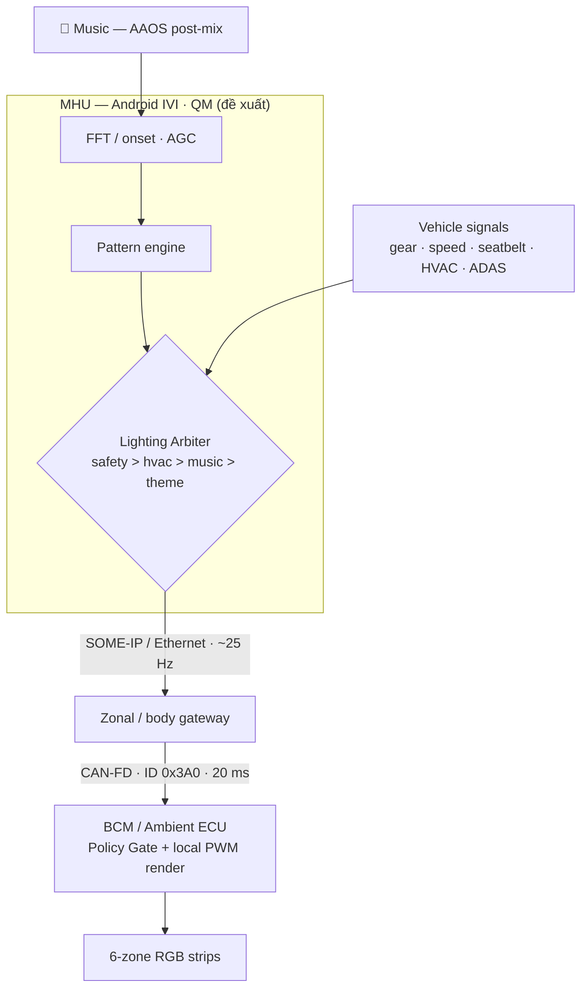

[](https://github.com/hoanghiepbk/Lights-music/actions/workflows/ci.yml)
<!-- Badge path = hoanghiepbk/Lights-music (repo root sau re-root D-009). -->

# NhipSang

**Music-reactive ambient lighting, tích hợp native trên MHU — an toàn theo chuẩn ô tô.**

> 🔗 Live demo: _<Vercel link — Thợ điền>_ · 🎬 Video: _<link — Hiệp điền>_

---

## Vấn đề

Đèn ambient factory trên xe VinFast còn cơ bản; chủ xe đang mua kit aftermarket "nháy theo nhạc" điều khiển qua app, **không kết nối với xe** — chạy mù, không biết xe đang lái hay đỗ, không nhường cảnh báo an toàn. Trải nghiệm (và doanh thu phụ kiện) đang chảy ra tiệm độ.

## Giải pháp

NhipSang đưa trải nghiệm đó vào trong: native trên MHU, **cộng sinh** với hệ đèn/cảnh báo sẵn có, an toàn hơn aftermarket, đóng gói được như feature OTA. Nguyên tắc xuyên suốt: **MHU đề xuất, ECU quyết.**

## Điểm kỹ thuật nổi bật

- **Lighting Arbiter** — giải quyết ưu tiên đa nguồn (`Safety > HVAC > Music > Theme`), deterministic. Kit aftermarket không có.
- **Distributed rendering** — MHU gửi param cấp cao (~25Hz), ECU render PWM cục bộ. Không đẩy per-LED 60fps lên bus (chống nghẽn).
- **Policy Gate** — 6 bất biến an toàn (màu/độ sáng/flash theo trạng thái xe), phân biệt rõ ambient-effect với safety-telltale.
- **Eval-as-code** — 6 bất biến assert trong **CI tier Critical (chặn merge)**; có màn "gate cắn thật" (`test:demo:violation`).
- **Audio DSP tự code** — FFT + onset (energy/spectral flux) + AGC + smoothing, không lib nặng.

## Kiến trúc

```
Music → [MHU: FFT/onset → pattern → Lighting Arbiter] → SOME-IP/Ethernet
      → [gateway] → CAN-FD → [BCM: Policy Gate + render PWM] → 6-zone RGB
```



Chi tiết: [`docs/design.md`](docs/design.md) — kiến trúc, signal schema thật, phân rã ASIL, OTA, homologation, Q&A phòng thủ.

## Tech stack

React · Vite · TypeScript · Tailwind · Web Audio API · Supabase Broadcast (transport) · Vitest + GitHub Actions (eval-as-code) · ESP32 + WS2812B (demo vật lý, optional).

## Chạy local

```bash
pnpm install
pnpm dev                  # simulator tại localhost:5173
pnpm test                 # critical + quality (xanh)
pnpm test:critical        # chỉ safety gate
pnpm test:demo:violation  # màn "gate cắn" — ĐỎ có chủ đích
```

_(Supabase optional: copy `.env.example` → `simulator/.env` để bật transport; thiếu env app vẫn chạy local bình thường.)_

## Cấu trúc repo

```
simulator/   # React UI + audio + core (pure TS) + transport
schema/      # @nhipsang/schema — types + HAL interfaces
eval/        # critical/ (safety gate) · quality/ · demo/ (gate-bites)
firmware/    # ESP32 + WS2812B (optional)
docs/        # design.md
```

## Eval-as-code

| Tier | Nội dung | Vai trò |
|------|----------|---------|
| **Critical** | INV-1..6 + fault injection | Chặn merge (required check) |
| **Quality** | audio · determinism · latency · throttle | Informational |
| **Demo** | gate-bites | Chạy tay khi quay video (đỏ có chủ đích) |

---

_Bản demo mô phỏng trung thực ranh giới lên xe thật (HAL interface swappable, schema thật, latency ghi rõ phần đo / phần target)._
